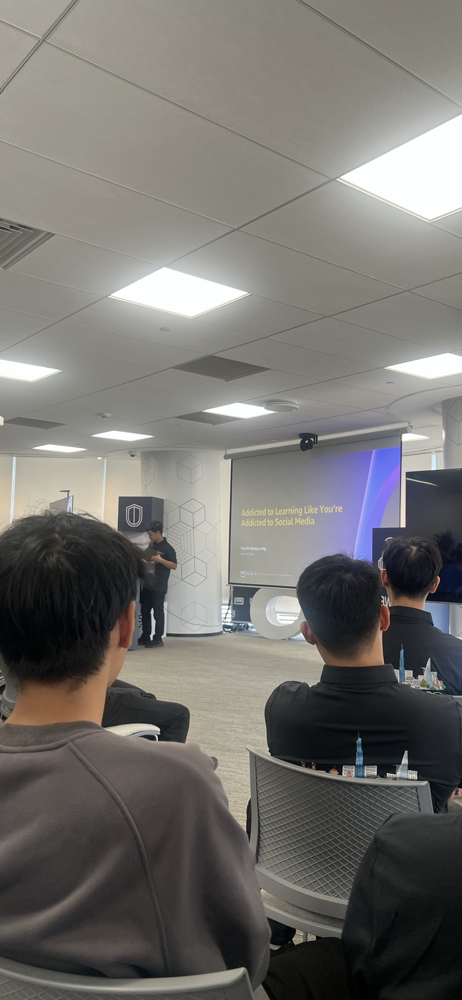

# Overview Report: “Weekend Knowledge Sharing Session”

### Event Objectives

- Foster a culture of lifelong learning and proactive self-improvement within the IT sector.
- Discover practical AI applications to boost coding efficiency and overall productivity.
- Introduce AI-driven software engineering workflows and modern development paradigms.
- Offer career orientation and cultivate the necessary mindset for tech students stepping into the industry.

### Speakers

- **Huỳnh Hoàng Long** – Addicted to Learning Like You're Addicted to Social Media
- **Thịnh Nguyễn** – Automated Prompt Engineering: Enhancing LLM Output Quality
- **Khang Nguyễn** – Career Opportunities & Mindset for Entering the Job Market
- **Nguyễn Phương Thảo** – BMAD Method – AI-Driven Development Workflow

### Key Highlights

#### Addicted to Learning Like You're Addicted to Social Media
- Establishing a daily, consistent tech-learning routine akin to scrolling through social feeds.
- Transitioning from reactive studying to building a sustainable, long-term knowledge system.
- Nurturing deep curiosity to keep pace with rapidly changing technology trends.
- Actionable advice on sustaining motivation and maximizing knowledge retention.

#### Automated Prompt Engineering: Enhancing LLM Output Quality
- Showcasing a personal project focused on Automated Prompt Engineering.
- Enhancing the accuracy and depth of LLM outputs through systematic prompt refinement.
- Minimizing manual prompt tuning while ensuring highly reliable AI responses.
- Real-world use cases of automated prompting in software architecture and API development.

#### Career Opportunities & Mindset for Entering the Job Market
- Mapping out current trends and emerging opportunities in the IT sector.
- Highlighting crucial hard and soft skills for upcoming graduates.
- The immense value of adaptability, teamwork, and proactive problem-solving.
- Strategies for crafting an impressive portfolio through hands-on side projects.

#### BMAD Method – AI-Driven Development Workflow
- Breaking down the BMAD method for integrating AI into the coding lifecycle.
- Utilizing AI agents across various software phases, from ideation to deployment.
- AI's role in requirement gathering, architecture planning, implementation, and QA testing.
- Exploring the open-source BMAD repository as a benchmark for modern development practices.

### Key Takeaways

#### Personal Growth
- **Lifelong learning** must become a daily ritual, not just a short-term sprint for an exam.
- A well-structured knowledge management system is vital for career longevity.
- Insatiable curiosity is a developer's best tool for adapting to industry shifts.

#### AI Integration
- **Prompt Engineering** is a critical skill for maximizing the utility of LLMs.
- Automating prompt pipelines drastically scales up developer productivity.
- AI extends far beyond code generation; it is a collaborative partner across the entire SDLC.

#### Career Readiness
- Recruiters look for a well-rounded balance of technical prowess and soft skills.
- Tangible project experience and a solid portfolio are your greatest assets.
- A continuous-growth mindset provides a significant competitive edge in the job market.

### Development Workflow
- Embracing AI-assisted frameworks significantly accelerates project delivery timelines.
- Seamlessly weaving AI into planning, execution, and testing reduces manual overhead.
- Open-source methodologies offer invaluable blueprints for building modern software.

### Actionable Next Steps
- Establish a daily tech-reading and coding routine to keep skills sharp.
- Implement Prompt Engineering tactics in current AI-backed features or personal projects.
- Study the BMAD framework to streamline both backend and frontend workflows.
- Keep building practical applications to refine technical depth and enhance my portfolio.
- Actively improve cross-functional communication and collaborative problem-solving.

#### Event Experience
Attending this sharing session was incredibly rewarding, offering actionable advice on career growth, AI tooling, and self-study habits. The blend of real-world stories and technical deep dives provided a clear roadmap that I can directly apply to my current projects and future career.

#### Learning from Industry Experts
- Gained wisdom from seasoned professionals on sustaining career momentum.
- Saw firsthand how effective daily habits compound over time to build real expertise.

#### Hands-on Technical Exposure
- Grasped the underlying mechanics of Automated Prompt Engineering and its impact on LLM consistency.
- Navigated the BMAD workflow to see how AI agents can orchestrate software development from end to end.

#### Leveraging Modern Tools
- Realized the massive potential of integrating AI into daily debugging and coding tasks.
- Discovered valuable open-source repositories to accelerate my technical learning.

#### Networking and Discussions
- Exchanged perspectives with industry peers, mentors, and AI enthusiasts.
- Received pragmatic advice on stepping confidently into the competitive tech job market.
- Reinforced the idea that technical chops must be paired with strong interpersonal skills.

#### Core Lessons Learned
- Continuous learning is the ultimate career hack in the fast-paced tech industry.
- AI is rapidly shifting from a novel tool to a mandatory co-pilot in software engineering.
- Mastering Prompt Engineering can drastically cut down development and debugging time.
- Success requires a blend of hard technical skills, real-world experience, and a resilient mindset.

#### Event Photos

> In summary, the "Weekend Knowledge Sharing Session" delivered exceptional value regarding AI-driven development, career strategies, and the psychology of continuous learning. The speakers' practical insights reshaped my approach to daily study habits and AI integration. Ultimately, the event left me highly motivated to refine my skill set, adopt modern AI frameworks, and step confidently into the IT industry.